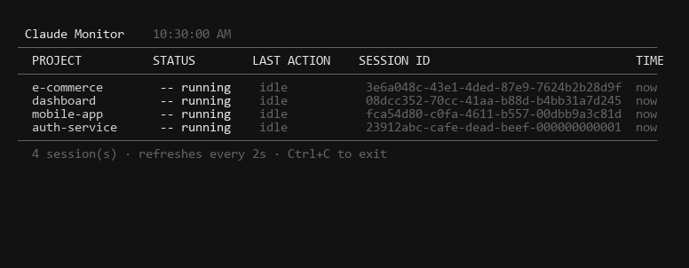

# Claude Monitor

A live terminal dashboard for monitoring multiple Claude Code sessions at once — with Windows toast notifications when any session needs your attention.



## How it works

- **Hooks** fire on every Claude Code event (tool use, stop, notification) and write a small status file per project
- **Monitor** reads those files + scans running Claude processes every 2s and renders a live table
- **Notifications** pop up via Windows toast whenever a session is waiting for input

## Setup

### 1. Copy scripts to `~/.claude/`

```
monitor.js       → ~/.claude/monitor.js
session-hook.js  → ~/.claude/session-hook.js
notify.ps1       → ~/.claude/notify.ps1
```

### 2. Add hooks to `~/.claude/settings.json`

```json
"hooks": {
  "SessionStart": [
    { "matcher": "", "hooks": [{ "type": "command", "command": "node ~/.claude/session-hook.js running" }] }
  ],
  "PreToolUse": [
    { "matcher": "", "hooks": [{ "type": "command", "command": "node ~/.claude/session-hook.js working" }] }
  ],
  "PostToolUse": [
    { "matcher": "", "hooks": [{ "type": "command", "command": "node ~/.claude/session-hook.js thinking" }] }
  ],
  "Stop": [
    { "matcher": "", "hooks": [{ "type": "command", "command": "node ~/.claude/session-hook.js done" }] }
  ],
  "Notification": [
    { "matcher": "", "hooks": [
      { "type": "command", "command": "node ~/.claude/session-hook.js waiting" },
      { "type": "command", "command": "powershell.exe -NonInteractive -WindowStyle Hidden -File \"%USERPROFILE%\\.claude\\notify.ps1\" -Message \"$CLAUDE_NOTIFICATION_MESSAGE\" -Project \"$(basename $PWD)\" 2>/dev/null &" }
    ]}
  ]
}
```

### 3. Run the monitor in a dedicated terminal tab

```bash
node "$USERPROFILE/.claude/monitor.js"
```

## What you see

```
 Claude Monitor  ⚠  1 needs your attention    10:30:16 AM
──────────────────────────────────────────────────────────────────────────────────────────
PROJECT          STATUS        LAST ACTION    SESSION ID                             TIME
──────────────────────────────────────────────────────────────────────────────────────────
mobile-app       !! waiting    idle_prompt    fca54d80-c0fa-4611-b557-00dbb9a3c81d  now  ← you
e-commerce       OK done                      3e6a048c-43e1-4ded-87e9-7624b2b28d9f  12s
dashboard        .. thinking   Bash           08dcc352-70cc-41aa-b88d-b4bb31a7d245  7s
auth-service     -- running    idle           23912abc-cafe-dead-beef-000000000001  18s
```

### Status indicators

| Symbol | Status    | Meaning                        |
|--------|-----------|--------------------------------|
| `>>`   | working   | Executing a tool               |
| `..`   | thinking  | Processing tool result         |
| `!!`   | waiting   | Needs your input (highlighted) |
| `OK`   | done      | Finished last response         |
| `--`   | running   | Detected, no hook data yet     |

## Crash recovery

Every session ID is persisted to `~/.claude/session-map.json`:

```json
{
  "3e6a048c-43e1-4ded-87e9-7624b2b28d9f": {
    "project": "e-commerce",
    "cwd": "C:/Users/.../e-commerce",
    "firstSeen": "2026-03-15T10:30:00.000Z",
    "lastSeen": "2026-03-15T11:45:22.000Z"
  }
}
```

After a crash, check this file to identify which session belongs to which project and use `claude --resume <session-id>` to pick up where you left off.

## Requirements

- Windows 10/11
- [Claude Code](https://github.com/anthropics/claude-code)
- Node.js
